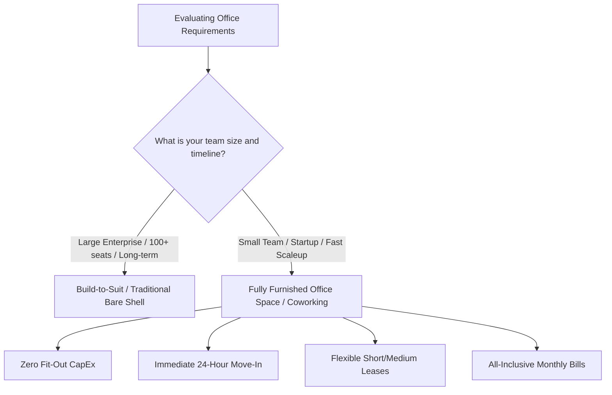

Coimbatore has transformed from a traditional manufacturing powerhouse into one of South India's fastest-growing startup and corporate destinations. Nicknamed the "Manchester of South India," the city blends industrial heritage, exceptional educational institutions, robust healthcare infrastructure, and an expanding IT ecosystem. For businesses establishing a regional footprint or expanding operations in Tamil Nadu, finding the ideal **office space for rent in coimbatore** is one of the most critical decisions leadership teams face.

Choosing the right locality directly influences your brand perception, employee commute satisfaction, client accessibility, operational costs, and talent recruitment. While the city offers commercial corridors extending across Avinashi Road, Peelamedu, Trichy Road, and Race Course, three neighborhoods stand out as dominant business hubs: **Gandhipuram**, **RS Puram**, and **Saravanampatti**.

Each of these three districts offers distinct advantages tailored to specific industry verticals, business models, and company stages. In this comprehensive guide, we compare Gandhipuram, RS Puram, and Saravanampatti across connectivity, rental rates, infrastructure, and business suitability to help you select the ideal **commercial space for rent in coimbatore**.

---

## The Evolving Commercial Landscape of Coimbatore

Historically driven by textile mills, precision engineering, foundries, and pump manufacturing, Coimbatore’s commercial economy has diversified rapidly over the past decade. Today, the city is a recognized center for:

* **SaaS and Enterprise Software Development:** Global tech innovators, boutique engineering studios, and AI startups.
* **BFSI and Wealth Management:** Private banking divisions, asset management firms, and financial brokerages.
* **Consulting, Legal, and Corporate Services:** Chartered accountancy firms, corporate law practices, and architecture studios.
* **Healthcare and MedTech:** Advanced biomedical research, medical device fabrication, and diagnostic support.
* **E-Commerce and Logistics:** Distribution regional headquarters, customer care hubs, and fulfillment coordination.

Because commercial requirements differ vastly between a 3-person creative consultancy and a 50-person software engineering team, demand for flexible workspace options has skyrocketed. Whether you need an entire independent floor plate, a cost-efficient **small office space for rent in coimbatore**, or a **fully furnished office space for rent in coimbatore**, understanding neighborhood dynamics is the first step toward smart real estate allocation.

---

## 1. Gandhipuram: The Central Commercial and Transit Epicenter

Positioned in the geographic heart of the city, **Gandhipuram** is Coimbatore's bustling Central Business District (CBD) and primary multimodal transit interchange. Anchored by the central bus stands (serving local, intercity, and interstate routes) and flanked by major commercial arteries like Cross Cut Road, 100 Feet Road, and Sathy Road, Gandhipuram pulses with high footfall and non-stop commercial activity.

### Ideal For:
* Retail headquarters, trading businesses, and distribution hubs
* Travel, logistics, recruitment agencies, and educational consultancies
* Branch offices requiring immediate walk-in accessibility for clients across Coimbatore and neighboring districts
* Financial service providers, NBFCs, and retail banking outposts

### Key Advantages of Office Space for Rent in Coimbatore Gandhipuram:
* **Unbeatable Public Transit:** Gandhipuram houses the city's central bus terminal complex (Town Bus Stand, Central Bus Stand, and Omni Bus Stand). Employees and visitors traveling from Pollachi, Tiruppur, Erode, Palakkad, or anywhere within city limits can reach your office without interchange friction.
* **Immense Commercial Density:** Everything a business needs—from banks, government administrative centers, and print shops to stationery suppliers, hardware vendors, and electronics retail—is within walking distance.
* **High Footfall and Street Visibility:** For enterprises that rely on walk-in walk-outs, physical brand signage on Cross Cut Road or 100 Feet Road offers unmatched organic exposure.

### Drawbacks & Challenges:
* **Severe Traffic Congestion:** Traffic jams during morning and evening rush hours are common, particularly near the bus station junctions and flyover entries.
* **Parking Shortages:** Older commercial buildings frequently lack dedicated basement parking, making visitor and executive four-wheeler parking a daily logistical challenge.
* **Noise and Density:** The sheer density of street commerce may not suit companies seeking quiet, high-focus R&D environments.

### Typical Rent Range:
* **Warm Shell / Unfurnished Commercial Space:** ₹45 to ₹75 per sq. ft. per month
* **Fully Furnished Office / Private Cabins:** ₹7,000 to ₹12,000 per desk/seat per month

For businesses seeking strategic **office space for rent in coimbatore gandhipuram**, selecting buildings with dedicated parking or opting for managed spaces that handle parking management is essential.

---

## 2. RS Puram: The Prestigious Corporate & Professional District

Situated to the west of the city center, **RS Puram (Rathina Sabapathi Puram)** is renowned as Coimbatore’s most prestigious, organized, and affluent commercial-cum-residential neighborhood. Planned with wide avenues, tree-lined boulevards, and upscale shopping corridors along D.B. Road (Diwan Bahadur Road) and T.V. Samy Road, RS Puram commands immense prestige.

### Ideal For:
* Corporate law firms, chartered accountants, tax advisory practices, and wealth managers
* Executive search, luxury retail headquarters, branding agencies, and high-end design consultancies
* Real estate developer corporate offices and regional liaison hubs
* Healthcare clinics, aesthetic centers, and wellness brands

### Key Advantages of Office Space for Rent in Coimbatore RS Puram:
* **Elite Brand Reputation:** An address in RS Puram immediately projects trust, financial stability, and established stature. Clients associate RS Puram with top-tier professionalism.
* **Organized Urban Layout:** Unlike congested commercial cores, RS Puram features a planned grid system with broad streets, superior pedestrian walkways, and landscaped surroundings.
* **Premium Dining & Lifestyle Amenities:** D.B. Road and adjacent streets host fine dining restaurants, upscale cafes, lifestyle brands, and boutique retail, making client entertainment and team luncheons effortless.
* **Quiet, Professional Working Atmosphere:** Despite active retail zones, the secondary streets offer tranquil settings ideal for focused executive operations and confidential client consultations.

### Drawbacks & Challenges:
* **Premium Rental Rates:** RS Puram carries some of the steepest commercial rental rates and security deposit requirements in the city.
* **Heritage Properties with Outdated Infrastructure:** Many independent buildings are converted residential properties or older commercial builds lacking power backup generators, modern elevators, or centralized HVAC.
* **Limited Large Floor Plates:** Companies looking for massive single-floor plates exceeding 10,000 sq. ft. will find limited options compared to peripheral IT corridors.

### Typical Rent Range:
* **Warm Shell Commercial Space:** ₹60 to ₹100+ per sq. ft. per month
* **Fully Furnished Office Space:** ₹9,000 to ₹15,000 per desk/seat per month

If your brand values elite client perception, high-ticket consultations, and executive charm, securing an **office space for rent in coimbatore rs puram** is well worth the premium investment.

---

## 3. Saravanampatti: The Thriving IT & Tech Highway

Located in the northeastern quadrant of Coimbatore along the Sathyamangalam National Highway (NH 209), **Saravanampatti** is the undisputed information technology capital of the region. Home to prominent IT parks such as the CHIL SEZ (Coimbatore Hi-Tech Infrastructure Limited), KGISL Tech Park, and numerous private software developments, Saravanampatti attracts Fortune 500 tech companies, SaaS pioneers, and burgeoning product startups.

### Ideal For:
* Tech startups, SaaS companies, and software engineering centers
* IT/ITES, BPO/KPO, customer service operations, and back-office delivery centers
* EdTech firms, AI/ML research labs, and digital product agencies
* Rapidly scaling teams needing scalable floor plates and flexible expansion options

### Key Advantages of Office Space in Saravanampatti:
* **Proximity to Vast Engineering Talent:** Saravanampatti is enveloped by top-ranking engineering colleges and technology institutes (including Kumaraguru College of Technology, KGiSL Institute of Technology, and SNS Institutions), creating a continuous pipeline of fresh engineering graduates and technical interns.
* **Modern Grade-A Infrastructure:** Commercial properties here are purpose-built for enterprise IT requirements, featuring 100% DG power backup, high-speed fiber redundant lines, central HVAC, multi-tier security, and sprawling basement car parks.
* **Affordable Large-Scale Real Estate:** Rental rates per square foot are significantly lower than central city districts, enabling startups to acquire larger spaces without blowing through runway capital.
* **Vibrant Startup Community:** Being surrounded by thousands of fellow tech founders, engineers, and digital innovators fosters peer learning, networking, and industry collaboration.

### Drawbacks & Challenges:
* **Distance from Central Railway Station & Airport:** Saravanampatti is situated approximately 10 to 12 km from Coimbatore Junction Railway Station and around 9 km from Coimbatore International Airport, meaning longer commutes during peak traffic.
* **Peripheral Location for Non-Tech Clients:** Traditional clients, government agencies, and retail customers residing in central or south Coimbatore may find the distance inconvenient for casual meetings.
* **Ongoing Infrastructure Construction:** Expanding highway corridors and flyover developments can periodically cause dust and traffic slowdowns along Sathy Road.

### Typical Rent Range:
* **Warm Shell Commercial Space:** ₹35 to ₹55 per sq. ft. per month
* **Fully Furnished Office / Managed IT Desk:** ₹5,500 to ₹8,500 per desk/seat per month

---

## Head-to-Head Comparison: Gandhipuram vs. RS Puram vs. Saravanampatti

To provide a clear perspective when evaluating your next **office for rent coimbatore**, here is a side-by-side comparison across key operational parameters:

| Evaluation Factor | Gandhipuram | RS Puram | Saravanampatti |
| :--- | :--- | :--- | :--- |
| **Primary Industry Fit** | Trading, Retail HQ, Logistics, BFSI, Consultancies | Legal, CA, Wealth Advisory, High-End Corporate | Tech Startups, SaaS, IT/ITES, Engineering Studios |
| **Average Warm-Shell Rent** | ₹45 – ₹75 / sq. ft. | ₹60 – ₹100+ / sq. ft. | ₹35 – ₹55 / sq. ft. |
| **Desk Pricing (Furnished/Coworking)** | ₹7,000 – ₹12,000 / seat | ₹9,000 – ₹15,000 / seat | ₹5,500 – ₹8,500 / seat |
| **Public Transit & Commute** | ⭐⭐⭐⭐⭐ (Central Bus Station hub) | ⭐⭐⭐⭐ (Accessible, city center) | ⭐⭐⭐ (Requires personal transport or Sathy bus) |
| **Parking Availability** | ⭐⭐ (Very constrained in core areas) | ⭐⭐⭐ (Street & paid parking, moderate) | ⭐⭐⭐⭐⭐ (Dedicated multi-level/basement parking) |
| **Access to Tech Talent** | ⭐⭐⭐ (City-wide transit connectivity) | ⭐⭐⭐ (General professional talent) | ⭐⭐⭐⭐⭐ (Adjacent to major engineering campuses) |
| **Client Perception & Prestige** | High commercial utility & footfall | Elite, upscale, premium corporate image | Modern, tech-forward, high-growth atmosphere |
| **Large Floor Plate Availability** | Low to Moderate | Low (Predominantly boutique spaces) | High (SEZ campuses & large commercial buildings) |

---

## Critical Factors When Choosing Commercial Space for Rent in Coimbatore

Before signing an office lease, commercial tenants must look beyond just square footage and quoted monthly rent. Here are essential factors every founder, facility manager, and enterprise director must evaluate:

### 1. The True Cost of Capital Expenditure (CapEx)
When viewing an unfurnished **commercial space for rent in coimbatore**, quoted prices often reflect a "bare shell" or "warm shell" state (bare concrete floors, basic masonry walls, unrouted wiring). Turning a raw shell into a functional office requires:
* Partitioning cabins, conference rooms, and acoustic phone booths
* Electrical distribution panels, power backup inverters/generators, and Cat6 cabling
* Air conditioning installation, ducting, and energy-efficient climate control
* Ergonomic chairs, desks, storage credenzas, and breakout lounges
* Interior lighting, access control biometric systems, and CCTV security

This interior fit-out can easily require an upfront capital investment of ₹1,200 to ₹2,500 per sq. ft. For small teams and early-stage companies, spending valuable working capital on non-recoverable interior assets creates unnecessary cash flow strain.

### 2. Security Deposit Terms and Lock-in Leases
Traditional commercial landlords in Coimbatore commonly demand:
* **6 to 10 months’ rent** upfront as an interest-free refundable security deposit.
* **3 to 5-year lock-in agreements** with steep financial penalties for early termination.
* **Annual rental escalations** ranging from 5% to 7% compounded year-on-year.

For businesses with evolving headcount projections, locking into a multi-year lease limits adaptability.

### 3. Power Infrastructure and Redundancy
Industrial and commercial power tariffs in Tamil Nadu, coupled with seasonal load shedding or transformer maintenance, necessitate robust power backup. Confirm whether the building offers automatic mains failure (AMF) diesel generator backup that powers the entire workspace—including heavy air conditioning loads—rather than just lighting and low-voltage plugs.

### 4. Statutory Approvals and Compliance
Ensure the building holds an approved commercial plan from the Coimbatore City Municipal Corporation (CCMC) or Local Planning Authority (LPA). Operating a corporate office from an unapproved or residential property exposes your business to regulatory notices and complicates your commercial [GST Registration](/virtual-office/gst-registration) and [Company Registration](/virtual-office/company-registration).

---

## Traditional Leases vs. Fully Furnished Office Space for Rent in Coimbatore

The modern workspace paradigm has decisively shifted toward agility. Instead of committing large amounts of capital to long-term traditional leases, businesses are embracing plug-and-play flexible offices.

### Why Choose a Fully Furnished Office Space for Rent in Coimbatore?
* **Zero Fit-Out CapEx:** Walk into an ergonomically designed office complete with standing desks, executive seating, gigabit internet, and enterprise-grade soundproofing.
* **Consolidated Operational Overhead:** Pay one transparent monthly invoice that bundles commercial rent, high-speed fiber internet, housekeeping, HVAC electricity, security, property taxes, and pantry supplies.
* **On-Demand Infrastructure:** Enjoy seamless access to state-of-the-art [meeting rooms](/meeting-room), presentation displays, conference speakerphones, and professional event spaces without leasing dedicated square footage that sits empty 80% of the working week.
* **Agile Scalability:** Add 2, 5, or 20 workstations as your team secures new client mandates, or downsize desks during lean operational cycles without lease-break penalties.

---

## Solutions for Startups: Small Office Space for Rent in Coimbatore

If you are a solo entrepreneur, boutique agency founder, or remote team lead, leasing a full 2,000 sq. ft. commercial floor is cost-prohibitive. However, working out of noisy cafes or home offices hampers productivity and undermines client trust.

Searching specifically for a **small office space for rent in coimbatore** opens up three highly efficient alternatives:

1. **Private Lockable Cabins in Managed Coworking Spaces:** Private team suites accommodating 2 to 10 team members that offer dedicated acoustic privacy for sensitive calls while sharing communal amenities like cafeterias, reception lounges, and restrooms.
2. **Dedicated Desks in Premium Shared Workspaces:** Reserved workstations in secure [coworking spaces](/coworking-space), complete with lockable pedestals, ergonomic seating, and high-speed Wi-Fi.
3. **Virtual Office Solutions:** If your team works entirely remotely but requires a premium commercial address in Gandhipuram or RS Puram for legal registration, postal handling, and client invoicing, a virtual office provides complete compliance at a tiny fraction of physical rental costs.

---

## Why WeeSpaces is the Preferred Workspace Partner in Coimbatore

At **WeeSpaces**, we eliminate the friction, delays, and exorbitant capital requirements of conventional commercial real estate. Our workspace solutions across Coimbatore and Kerala are designed to help ambitious companies thrive from day one.

### Our Comprehensive Workspace Offerings Include:
* **Private Managed Offices:** Tailored, fully furnished private office suites equipped with branded signage, ergonomic furniture, and secure biometric access.
* **Modern Coworking Spaces:** Vibrant hot desks and dedicated desks designed to maximize focus, creativity, and professional collaboration.
* **Executive Meeting Rooms:** On-demand, tech-enabled boardrooms and client presentation suites bookable by the hour or day via our [meeting room booking platform](/meeting-room).
* **Virtual Office Addresses:** Verified, premier commercial addresses in prime business zones for seamless GST registration, MCA company incorporation, and professional mail handling.

Whether you are seeking an elite corporate base in **RS Puram**, a central commercial presence in **Gandhipuram**, or a tech-oriented base near **Saravanampatti**, WeeSpaces provides the physical infrastructure and operational support your enterprise needs to scale seamlessly.

---

## Frequently Asked Questions (FAQ)

### What is the average rent for office space in Coimbatore?
Commercial office rents in Coimbatore vary depending on the location, building classification, and furnishing status. Unfurnished warm-shell spaces range from **₹35 to ₹55 per sq. ft.** in Saravanampatti, **₹45 to ₹75 per sq. ft.** in Gandhipuram, and **₹60 to ₹100+ per sq. ft.** in prime RS Puram. For a **fully furnished office space for rent in coimbatore**, managed desks generally range from **₹5,500 to ₹15,000 per seat per month**, inclusive of utilities, internet, and maintenance.

### Which area in Coimbatore is best for tech startups?
**Saravanampatti** is the leading choice for software companies, tech startups, and IT/ITES firms due to its proximity to the CHIL SEZ, KGISL Tech Park, engineering colleges, and purpose-built IT infrastructure. For client-facing software consultancies, **Avinashi Road** and **RS Puram** are also popular alternatives.

### Which locality is recommended for professional service firms like CAs and advocates?
**RS Puram** is widely considered the premier hub for chartered accountants, corporate law practices, financial advisors, and wealth management consultancies due to its high-net-worth client base, professional prestige, and sophisticated commercial environment.

### What are the hidden costs of renting a traditional commercial office in Coimbatore?
When leasing a traditional bare-shell property, tenants often incur significant expenses beyond the base rent, including:
* Upfront interior design and civil fit-out costs (₹1,200 – ₹2,500/sq. ft.)
* Electricity security deposits and high commercial power tariffs
* Monthly common area maintenance (CAM) charges
* Dedicated generator fuel and maintenance costs
* Daily janitorial, security, and reception staff payroll
* Separate high-speed commercial fiber broadband subscriptions

Choosing a managed workspace or fully furnished private cabin bundles all these variable overheads into a single predictable monthly payment.

### Can I get a commercial office address in Coimbatore without leasing physical space?
Yes. Through a verified virtual office package, you can secure a legally compliant commercial business address in Coimbatore for official MCA company incorporation, GST registration, bank account opening, and corporate correspondence without paying physical desk rent. WeeSpaces provides complete documentation, including registered rental agreements, property tax receipts, owner NOCs, and on-site signage displays.

### How quickly can a team move into a fully furnished office space in Coimbatore?
While traditional commercial leases require 2 to 4 months of lease negotiations and interior construction, a **fully furnished office space for rent in coimbatore** with WeeSpaces allows teams to move in within **24 to 48 hours**. Desks, ergonomic seating, high-speed fiber internet, and access controls are fully operational upon arrival.

---

<VoInternalLinks />
